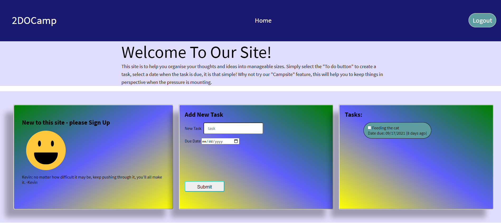
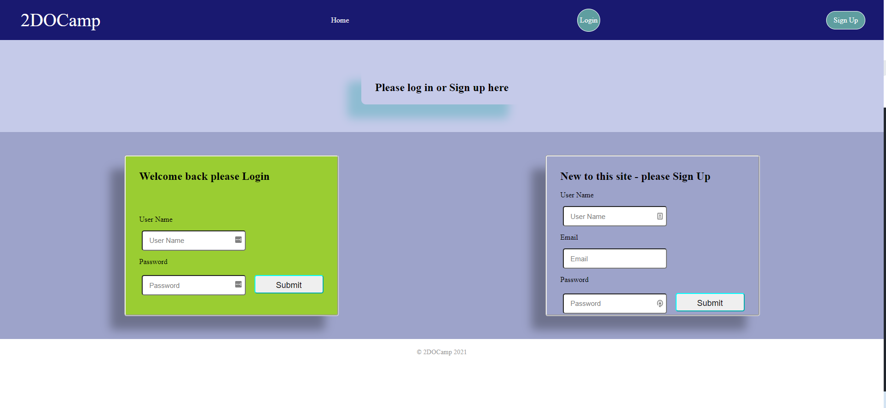

## 2DoCamp Description
A to do list app, focused on organizing future cohort students and providing advice, resources, and motivational messages to boost their morale and productivity!

## The Creators
Mel Jack - https://github.com/meljack1
Carol Gordon - https://github.com/Cgordon-bee
Dylson Oliveira - https://github.com/Dylson14?tab=repositories 

## Challenges throughout the project

* Bottleneck work processes
* Gaps in knowledge
* Time management (due to time restrictions)

## Successes throughout the project

* Positive Team Morale
* Focused on creating the MVP first
* Group worked independently outside of office hours

## Project Requirements
* Use Node.js and Express.js to create a RESTful API.

* Use Handlebars.js as the template engine.

* Use MySQL and the Sequelize ORM for the database.

* Have both GET and POST routes for retrieving and adding new data.

* Use at least one new library, package, or technology that we haven’t discussed.

* Have a folder structure that meets the MVC paradigm.

* Include authentication (express-session and cookies).

* Protect API keys and sensitive information with environment variables.

* Be deployed using Heroku (with data).

* Have a polished UI.

* Be responsive.

* Be interactive (i.e., accept and respond to user input).

* Meet good-quality coding standards (file structure, naming conventions, follows best practices for class/id naming conventions, indentation, quality comments, etc.).

## Installation Instruction

* Run NPM to install all of the packages

* Run SQL run source schema.sql

* run NPM start to get the express server live

## Overall

Within 2 weeks we were able to develop a functioning to do list app with all the routes set up and a eye-catching front-end design. The teams chemistry was high and we worked independently and as a team throughout. overall a great experience and a great application that future cohort students can use to organize their tasks.

## Links to Project
https://to-do-camp.herokuapp.com/
https://github.com/meljack1/2DoCamp

## Links to Presentation
https://tinyurl.com/4vrn8h8a

## App Screenshot

